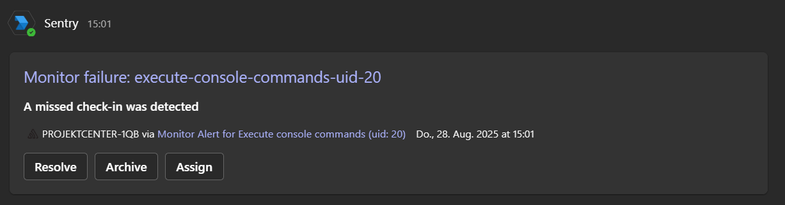

# Sentry Cron Monitor and Microsoft Teams Alerts Generator for TYPO3 Scheduler Tasks

## What does this extension do?
When a scheduler task runs:
- It will create a monitor and an alert in Sentry for the given scheduler task if there is none yet.
- It will send a check-in status to Sentry to indicate whether the task was successful or not.
- If the task fails, it will send a status error to Sentry, and the alert (only in Production) from the cron monitor will send a notification to the configured Microsoft Teams channel. Example:

## Requirements:
- Microsoft Teams Integration in Sentry + add App to Channel to get $integrationIdMsTeams in Sentry: [https://develop.sentry.dev/integrations/msteams/](https://develop.sentry.dev/integrations/msteams/)
- Succeussful Integration in Channel:
  

## Extension Configuration:
1. **Integration ID for Microsoft Teams in Sentry**: `$integrationIdMsTeams`
   - You can get this from the URL of the Microsoft Teams Integration in Sentry when you hover over "Configure."
2. **Organization Name in Sentry**: `$orgName`
3. **Name of the Microsoft Teams channel for notifications**: `$teamsChannelName`
4. **Authorization token for the Sentry API**: `$authToken`
   - You can create this token in the User Auth Tokens in Sentry.
   - Make sure to grant read and write permissions to alerts.

